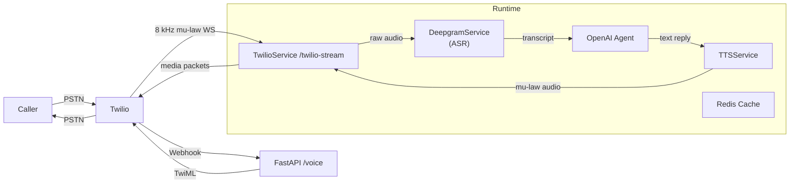

# PoloLabs VoiceAgent – Real-Time Conversational Voice AI

> End-to-end platform for phone-based conversational AI with HIPAA-grade security.

---

## Table of contents
1.  Overview
2.  High-level architecture
3.  Request / response flow
4.  Core components
5.  Security & compliance
6.  Local development
7.  Deployment (ECS)
8.  Environment variables
9.  Telephony configuration (Twilio)
10. Observability & troubleshooting
11. Contributing
12. License

---

## 1  Overview
PoloLabs **VoiceAgent** turns an inbound phone call into a conversation with an LLM-powered agent.  The service:

1. Receives a PSTN call via Twilio Voice.
2. Streams raw µ-law audio over WebSockets.
3. Transcribes the caller with **Deepgram** (real-time ASR).
4. Sends the transcript to an **OpenAI** tool-enabled agent (via MCP middleware).
5. Synthesises the reply with **ElevenLabs** TTS.
6. Streams the audio back to Twilio, which plays it to the caller.

Everything runs inside a single FastAPI process (Python 3.11) that exposes two public endpoints:

| Path | Method | Purpose |
|------|--------|---------|
| `/voice` | POST | Twilio webhook – returns `<Connect><Stream>` TwiML |
| `/twilio-stream` | WS | Full-duplex audio stream between Twilio & VoiceAgent |

---

## 2  High-level architecture


### Component map
* **main.py** – FastAPI app, auth, X-Ray instrumentation, lifespan hooks.
* **twilio.py** – `TwilioService`: call state, WebSocket, VAD, keep-alive.
* **dpg.py** – `DeepgramService`: ASR streaming & callbacks.
* **ell.py** – `TTSService`: ElevenLabs integration, welcome prompt.
* **oai.py** – Agent orchestration (MCP, tool runner, streaming deltas).
* **services/cache.py** – Redis (ElastiCache IAM-auth) wrapper.
* **utils.py** – Logging, PHI redaction, AWS SecretsManager bootstrap.

---

## 3  Detailed request / response flow
1. **Incoming call** – Twilio hits `/voice` with POST `CallSid` etc.
2. **TwiML response** – API returns `<Connect><Stream url="wss://…/twilio-stream"/>`.
3. **WebSocket upgrade** – Twilio opens a WS with Basic Auth (SID/TOKEN).
4. **Authentication** – `authorize_twilio_websocket` validates creds.
5. **Media exchange** – 20 ms µ-law frames (inbound) & keep-alive pings.
6. **ASR** – Frames are piped to Deepgram; interim & final transcripts pushed back via async callback.
7. **Conversation manager** – `TwilioService.process_transcript` streams each final transcript to the OpenAI agent; interim transcripts are used for VAD / barge-in handling.
8. **LLM response streaming** – `oai.stream_agent_deltas` yields tokens as they arrive; they are chunked into 20 ms audio bursts by `TTSService.stream_response_to_user`.
9. **Playback** – Audio chunks are Base64-encoded and sent back over the same WS as Twilio *media* messages.
10. **Call termination** – User hangs up or 15-minute hard limit triggers; timers in `utils.enforce_call_length_limit` clean up Deepgram & WebSocket.

---

## 4  Core components
### FastAPI application (`main.py`)
* Lifespan manager initialises Deepgram, TTS & agent once per process.
* Signature validation for Twilio webhook (`verify_twilio_signature`).
* IAM header check for privileged debug endpoints.
* AWS X-Ray patches with on-the-fly PHI redaction.

### TwilioService (`twilio.py`)
| Capability | Notes |
|------------|-------|
| Webhook handler | Generates TwiML & fires connection warm-ups |
| WebSocket handler | Auth, state machine, frame routing |
| Silence watchdog | Prompts "still there?" after configurable gap |
| Call-length guard | Gracefully ends call after 15 min |
| Media buffering | Holds frames until Deepgram WS is up |
| Barge-in / VAD | Immediate agent interruption on caller speech |

### DeepgramService (`dpg.py`)
* Opens persistent WebSocket to Deepgram.
* Reconnects with back-off if upstream drops.
* Emits transcripts to registered callbacks.

### Agent layer (`oai.py`)
* Agent defined in **AGENTS.md** with MCP tooling.
* Warm-up requests eliminate cold-start latency.
* Streaming interface surfaces token deltas as soon as they arrive.

### TTS layer (`ell.py`)
* ElevenLabs v2 Flash model, 8 kHz µ-law output.
* Strips WAV headers client-side.
* Chunks audio ≤3.2 KB (400 ms) to honour Twilio limits.

### Redis cache (`services/cache.py`)
* Choice of standalone or cluster endpoint.
* Optional IAM authentication (SigV4 token provider).
* Graceful in-memory fallback when Redis unavailable.

---

## 5  Security & compliance
* **HIPAA** – All logs redact PHI (phone numbers, email, UUIDs, URLs, Twilio SIDs).  Audit events logged per §164.312(b).
* **Secrets management** – Single JSON secret in AWS Secrets Manager; injected at startup (`ENV_VARS_ARN`).
* **Transport security** – TLS enforced for Redis (`rediss://`), Deepgram, OpenAI & public endpoints (behind ALB / API Gateway).
* **AWS X-Ray** – Custom emitter scrubs trace data before UDP send.
* **GitHub OIDC** – `deploy.yml` assumes a tightly-scoped IAM role, no static keys.

---

## 6  Local development
```bash
# 1. Clone & enter dir
git clone https://github.com/your-org/pl-voiceagent.git
cd pl-voiceagent

# 2. Populate .env (see next section)

# 3. Run services
make dev            # or
docker-compose up   # includes ngrok for public tunnel
```
The dev `docker-compose.yml` runs the FastAPI app plus an **ngrok** side-car so Twilio can reach your localhost.

---

## 7  Deployment (ECS)
The included GitHub Actions workflow builds the image, pushes to ECR and triggers an ECS rolling update:
```text
.github/workflows/deploy.yml
```
Replace the role ARN / cluster / service names with your own, or store them in repository secrets.

---

## 8  Required environment variables
| Name | Purpose | Example |
|------|---------|---------|
| `OPENAI_API_KEY` | Chat completion & tool calls | sk-… |
| `DEEPGRAM_API_KEY` | Streaming ASR | 123abc |
| `ELEVENLABS_API_KEY` | TTS synthesis | eab… |
| `TWILIO_AUTH_TOKEN` | Webhook signature validation & WS auth | 1a2b… |
| `TWILIO_ACCOUNT_SID` | WS Basic Auth username | AC… |
| `REDIS` | Redis endpoint URL | rediss://host:6379/0 |
| `ENV_VARS_ARN` | (optional) ARN of Secrets Manager JSON blob | arn:aws:… |
| `MCP_SERVER_URL` | (optional) Custom MCP server | https://mcp… |

Put them in **.env** (which is git-ignored) or an AWS secret.

---

## 9  Telephony configuration (Twilio)
1. Create a Programmable Voice **phone number**.
2. Set its Voice webhook to `POST https://<your-domain>/voice`.
3. Enable **WebSocket** in Voice > Streaming, URL `wss://<your-domain>/twilio-stream`.
4. Paste your `TWILIO_AUTH_TOKEN` in both the console and server env.
5. Optionally tweak "Maximum Call Duration" in `utils.enforce_call_length_limit`.

---

## 10  Observability & troubleshooting
* **Logs** – Structured, UTC timestamps, PHI-redacted.  `LOG_LEVEL=DEBUG` for verbose output.
* **AWS X-Ray** – Service map + traces (sans PHI) when running in AWS.
* **/websocket-status** – Protected endpoint reporting live WS count (requires IAM header).
* **/websocket-metrics** – Prometheus-style metrics for frame counts & latency.

---

## 11  Contributing
Pull requests welcome!  Please ensure new code:
* Passes `ruff` + `black`.
* Includes type hints (`mypy` passes).
* Keeps all HIPAA compliance helpers intact.

---

## 12  License
© 2024 PoloLabs – MIT License. 